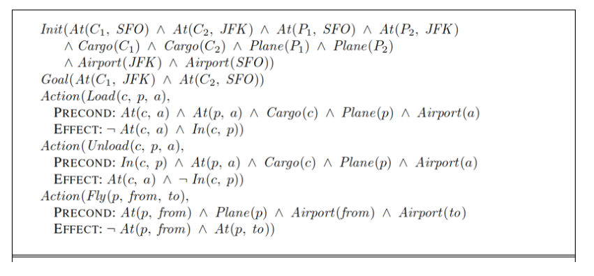

# py2pddl (Python to PDDL)

Write your planning task in Python classes, then translate
them to PDDL files.

Design:

As a user, I want to be able to

* define the domain and problem simply.
* be warned with pylint static checking on wrong types
* be warned with type checking while parsing
* not have any silly errors in the generated pddl file

---

* [Requirements](##requirements)
* [Sample](##sample)

## Requirements

* Python 3.6
* fire (`pip install fire`)

## Sample

Here is a sample Air Cargo problem:



### Defining the domain

In `flying.py`,

1. Inherit from `Domain`
2. Define types at the top (here, it's `Block`)
3. Define predicates as methods decorated with `@predicate`
4. Define actions as methods decorated with `@action`

```python
from py2pddl import Domain, create_type
from py2pddl import predicate, action

class AirCargoDomain(Domain):

    Plane = create_type("Plane")
    Cargo = create_type("Cargo")
    Airport = create_type("Airport")

    @predicate(Cargo, Airport)
    def cargo_at(self, c, a):
        pass

    @predicate(Plane, Airport)
    def plane_at(self, p, a):
        pass

    @predicate(Cargo, Plane)
    def in_(self, c, p):
        pass

    @action(Cargo, Plane, Airport)
    def load(self, c, p, a):
        precond = [self.cargo_at(c, a), self.plane_at(p, a)]
        effect = [~self.cargo_at(c, a), self.in_(c, p)]
        return precond, effect

    @action(Cargo, Plane, Airport)
    def unload(self, c, p, a):
        precond = [self.in_(c, p), self.plane_at(p, a)]
        effect = [self.cargo_at(c, a), ~self.in_(c, p)]
        return precond, effect

    @action(Plane, Airport, Airport)
    def fly(self, p, orig, dest):
        precond = [self.plane_at(p, orig)]
        effect = [~self.plane_at(p, orig), self.plane_at(p, dest)]
        return precond, effect
```

### Defining the problem

In `flying.py`,

1. Inherit from `BlocksDomain`, the class above
2. Define objects in `__init__`
3. Define init with a method decorated with `@init`
4. Define goal with a method decorated with `@goal`

```python
from py2pddl import create_objs
from py2pddl import goal, init

class AirCargoProblem(AirCargoDomain):

    def __init__(self):
        super().__init__()
        self.cargos = create_objs(AirCargoDomain.Cargo, [1, 2], True, "c")
        self.planes = create_objs(AirCargoDomain.Plane, [1, 2], True, "p")
        self.airports = create_objs(
            AirCargoDomain.Airport, ["sfo", "jfk"], False)

    @init
    def init(self):
        at = [self.cargo_at(self.cargos["c1"], self.airports["sfo"]),
              self.cargo_at(self.cargos["c2"], self.airports["jfk"]),
              self.plane_at(self.planes["p1"], self.airports["sfo"]),
              self.plane_at(self.planes["p2"], self.airports["jfk"]),]
        return at

    @goal
    def goal(self):
        return [self.cargo_at(self.cargos["c1"], self.airports["jfk"]),
                self.cargo_at(self.cargos["c2"], self.airports["sfo"])]

```

To generate the PDDL files, run

```text
python -m py2pddl flying.py
```

You can also import is as a module and generate the 2 files.
You only need to import the Problem class, instantiate and
generate the relevant files.

```python
from flying import GridCarProblem

p = GridCarProblem()
p.generate_domain_pddl()
p.generate_problem_pddl()
```

If you want the problem PDDL to be more dynamic if you have
changing inits and goals, you could use dictionaries and
specify in the `init` or `goal` keyword argument.

```python
p.generate_problem_pddl(
    goal={"cargo": "C2"})
```

Here is the generated `domain.pddl` file.

```text
(define
	(domain somedomain)
	(:requirements :strips :typing)
	(:types
		airport
		cargo
		plane
	)
	(:predicates
		(cargo_at ?c - cargo ?a - airport)
		(in_ ?c - cargo ?p - plane)
		(plane_at ?p - plane ?a - airport)
	)
	(:action fly
		:parameters (?p - plane ?orig - airport ?dest - airport)
		:precondition (plane_at ?p ?orig)
		:effect (and (not (plane_at ?p ?orig)) (plane_at ?p ?dest))
	)
	(:action load
		:parameters (?c - cargo ?p - plane ?a - airport)
		:precondition (and (cargo_at ?c ?a) (plane_at ?p ?a))
		:effect (and (not (cargo_at ?c ?a)) (in_ ?c ?p))
	)
	(:action unload
		:parameters (?c - cargo ?p - plane ?a - airport)
		:precondition (and (in_ ?c ?p) (plane_at ?p ?a))
		:effect (and (cargo_at ?c ?a) (not (in_ ?c ?p)))
	)
)
```

And here is the generated `problem.pddl` file.

```text
(define
	(problem someproblem)
	(:domain somedomain)
	(:objects
		sfo jfk - airport
		c1 c2 - cargo
		p1 p2 - plane
	)
	(:init (cargo_at c1 sfo) (cargo_at c2 jfk) (plane_at p1 sfo) (plane_at p2 jfk))
	(:goal (and (cargo_at c1 jfk) (cargo_at c2 sfo)))
)
```

Then use your favourite planner like [Fast Downward](https://github.com/aibasel/downward).
To output a plan. Here's the plan generated from the above PDDL:

```text
(load c1 p1 sfo)
(fly p1 sfo jfk)
(load c2 p1 jfk)
(unload c1 p1 jfk)
(fly p1 jfk sfo)
(unload c2 p1 sfo)
; cost = 6 (unit cost)
```

See more examples in the `pddl/` folder.
